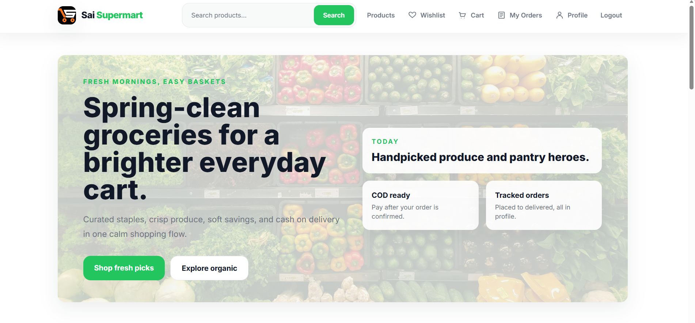
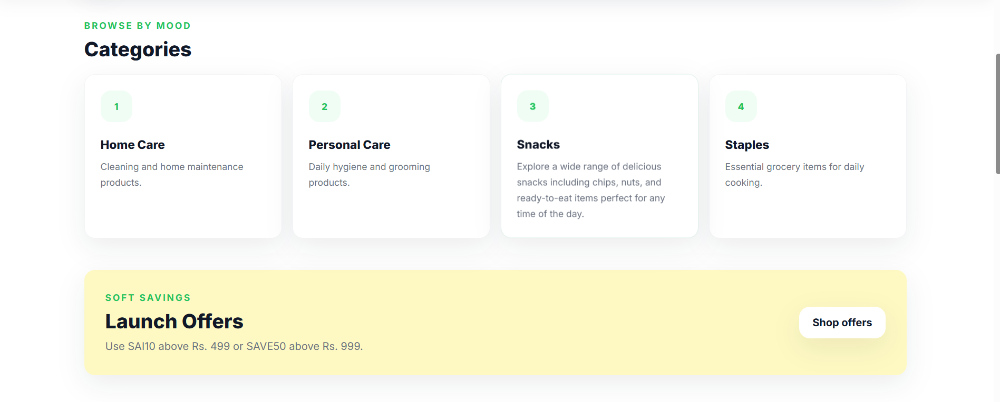
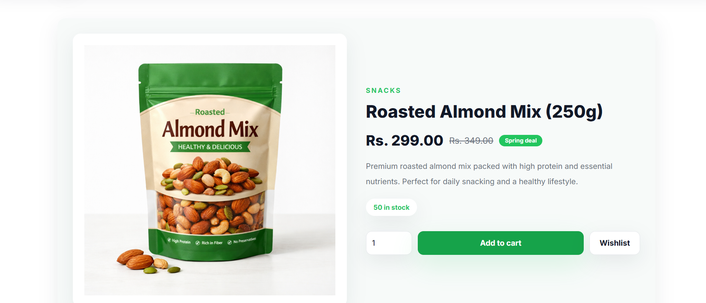
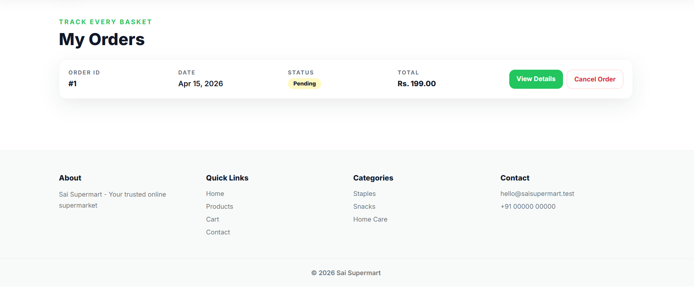
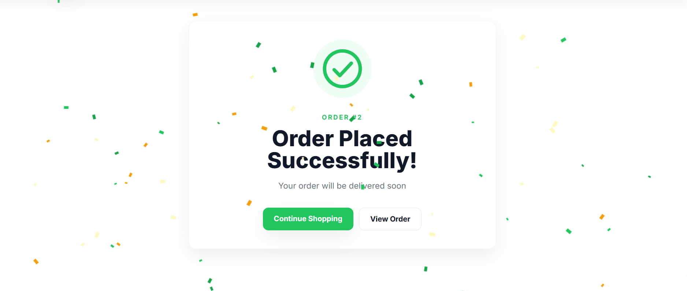

<!-- LOGO -->
<p align="center">
  
</p>

<h1 align="center">🛒 Sai Supermart</h1>

<p align="center">
  A Full-Stack E-commerce Web Application built for a real-world supermarket experience
</p>

<p align="center">
  <b>Django • PostgreSQL • Responsive UI • Real Business Logic</b>
</p>

---

## 🌿 Introduction

Sai Supermart is not just a demo store — it is designed as a **real-world supermarket web application**.

It allows users to browse products, manage carts, apply offers, and place orders using a smooth and intuitive interface. The system is built around **practical retail workflows**, making it suitable for both academic and real business use.

---

## ✨ Features

- 🔐 Email-based authentication (Login / Signup)  
- 🛍️ Product catalog with categories and featured items  
- 🔎 Search and filtering system  
- ❤️ Wishlist support  
- 🛒 Smart cart with quantity updates  
- 🎁 Offer and coupon system  
- 💵 Cash on Delivery checkout  
- 📦 Order history + cancellation  
- 🧾 Stock management (auto update)  
- ⚙️ Admin panel for full control  
- 📱 Fully responsive UI (mobile-friendly)  

---

## 🧰 Tech Stack

<p align="center">
  
</p>

**Frontend:** HTML, CSS, JavaScript, Tailwind  
**Backend:** Django (Python)  
**Database:** PostgreSQL  

---

## ⚙️ Installation

```bash
git clone <your-repo-url>
cd sai_supermart
python -m venv venv
venv\Scripts\activate
pip install -r requirements.txt
🗄️ Database Setup
CREATE DATABASE sai_supermart_db;

Update database credentials in settings.py or .env.

🚀 Run Project
python manage.py migrate
python manage.py seed_store
python manage.py createsuperuser
python manage.py runserver

👉 Open: http://127.0.0.1:8000/

👉 Admin: http://127.0.0.1:8000/admin/

🧠 Business Logic
Only registered users can order
Cash on Delivery only
Offers apply based on minimum order value
Delivery restricted to PIN: 414605
📸 Screenshots
🏠 Homepage
<p align="center">  </p>
🛍️ Categories
<p align="center">  </p>
⭐ Featured Products
<p align="center">  </p>
📦 Product Page
<p align="center">  </p>
🧾 My Orders
<p align="center">  </p>
✅ Order Placed
<p align="center">  </p>
🔮 Future Improvements
💳 Online Payment Integration
📍 PIN validation at checkout
⭐ Reviews & Ratings
📊 Admin analytics dashboard
📦 Delivery tracking system
👨‍💻 Author

Yash Bohat
Founder – NovaSyndicate Studios

⭐ Final Note

This project is built with a focus on real-world usability, clean UI, and practical backend logic.